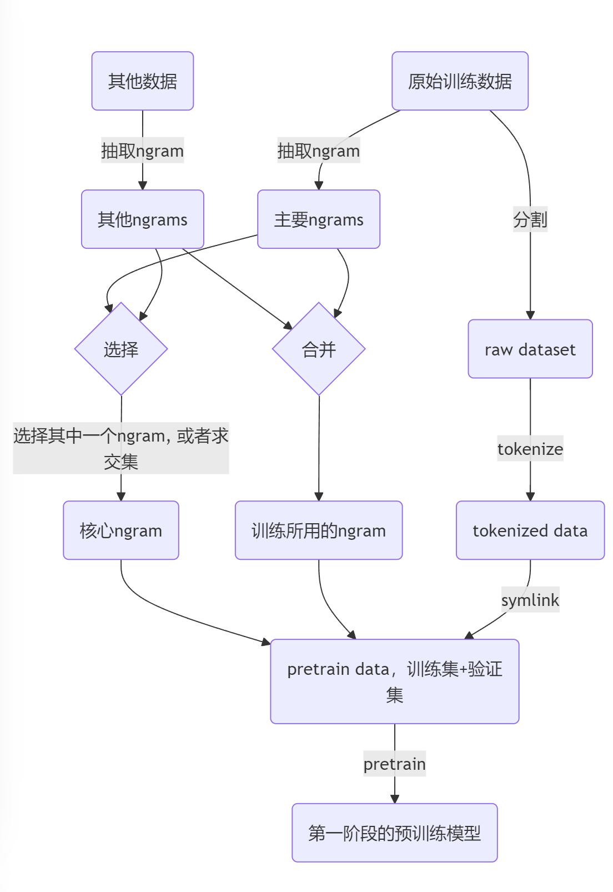

# Pipeline of pretraining and finetuning （2025-3-3）

在pretrain之前，我们需要准备好`tokenizer`, 基座模型, `ngram`, `raw dataset`, `tokenized dataset`, [`core ngrams`](./terminologies.md#core-ngrams)。 其中，基座模型是`DNABERT2`, `tokenizer` 使用的是`DNABERT2`的。

## 第一阶段预训练流程

这是截至2025-3-3的预训练的流程图。

## 为什么不使用tokenized dataset抽取ngram？

tokenized dataset经过了分割，而且有`[CLS]` `[SEP]`等特殊字符。不仅如此，我们抽取ngram的数据处理方式进行了多次改进(比如我们需要去除GUE中老鼠的负样本，或者需要从mspeices+hs38上抽取，或者需要从hg38+gue上抽取)。现在硬盘空间很紧张，如果需要把每一个版本的ngram抽取来源的tokenized dataset都保存，不仅会加大流程的复杂度，硬盘空间也是一个很大的限制。

## 如何管理这些流程？

如图所见，流程之间具有复杂的依赖关系。我们可以通过拓扑排序得知哪些流程可以并行（比如我们可以在tokenize dataset的同时抽取主要ngram和其他ngrams），哪些不可以，以及修改了某处pipeline后哪些脚本需要重新跑。然而，由于流程多变，手动进行拓扑排序并不是一个明智的选择。详细解决方案请见[这个文档](./makefile.md)。